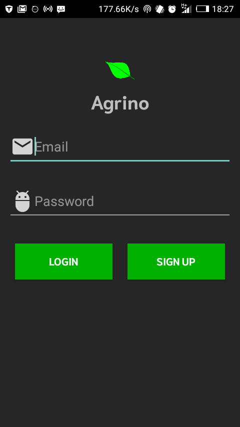
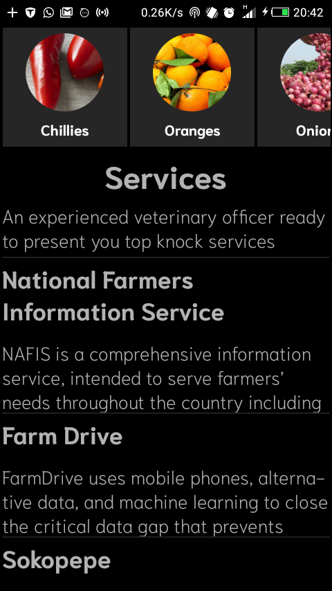
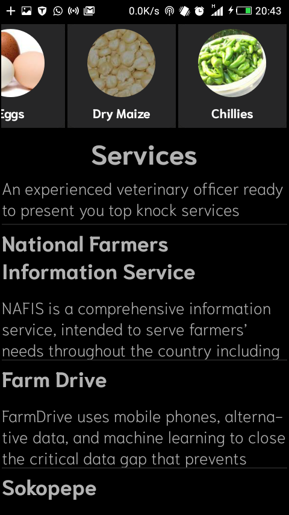

# Agrino :cool:

An android application to information farmers of services around there location

## Description

An app to help farmers access agricultural services within and outside their location

## How It Works

1. Splash Screen
As any awesome:smile: android app would be its has a splash screen
that has a spinner to attract and allow async tasks run in the background for
at most 3 sec

2.  Login Activity
The application allows login with your credentials to open doors for a wonderful
problem solving world.

3. Intro Activity
Here you will find a couple of things

* Recycler View with crop images and names retrieved from the Internet
* List View with major companies and organizations that offer farm services.\

