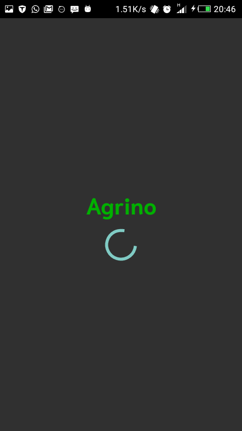

# Agrino
An android application to information farmers of services around there location

## Description

An app to help farmers access agricultural services within and outside their location

## How It Works

1. **Splash Screen**
* As any awesome:smile: android app would be its has a splash screen
that has a spinner to attract and allow async tasks run in the background for
at most 3 sec

2. **Login Activity**

* The application allows login with your credentials to open doors for a wonderful
problem solving world.

3. **Intro Activity**
* Here you will find a couple of things

* Recycler View with crop images and names retrieved from the Internet
* List View with major companies and organizations that offer farm services.

## New Features **Version 2**

### Images

1. **Resource Fragment**

* This fragment proves crucial for technical farmers who want to keep up reading new content from
interested areas they would like to read on.

2. **Services Fragment**
* This fragment  provides services from agriculture service vendor and also a platform for
other agriculture related  companies to advertise them selves.

## Challenges

1. Access Rate Limiting by aWhere API to 20 requests per hour which
will make Agrino move towards acquiring more data and creating my APIs to solve this

## Installation

In order to use this application you will need first clone and build the app
since it has not been deployed yet

### **Requirements**

###  Connection to the Internet
This will enable you to download dependencies used in the project as will as
retrieve images from the Internet

### Android Studio or any Android Programming Editor (*Android Studio is the best*);
This tool will help build the apk and refactor if need be

### Android Emulator or Phone
To test whether the app works on your device

## Technologies Used
1. XML
Defining Layouts and Resources used in my app not forgetting the manifest
2. Java
The engineering language behind the apps functionality
3. Google Fonts
Narmit Bold and Normal for the app fonts
4. Circular Image View Dependency
To create my Recycler View Item Circular Image
5. Glide
To ensure smooth image loading since images are retrieved from the Internet
6. Okhttp3
A Network Loading library that helps me create async requests making my application
perfom the same regardless of multiple authentication steps by the OAuth 2 authorization method aWhere API uses.
7. aWhere API
An api to retrive crop information in a particular field set

## LICENSE
Check the [LICENSE](LICENSE) out

## By
**Collins Magondu Muthinja**
